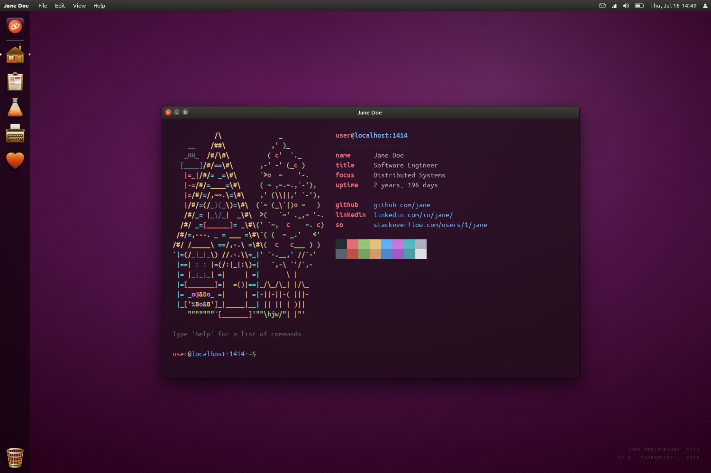

# ubuntu-unity

A personal-site Hugo theme styled after the Ubuntu 14.04 Unity desktop. Your pages render inside a draggable desktop window under a top panel with working indicator menus and a launcher dock, and the home page is an interactive terminal.



**Demo:** [jacobcolvin.com](https://jacobcolvin.com), or run the bundled [example site](#example-site).

## Features

- **Home terminal.** An xterm.js shell with a bash-like parser (pipes, redirections, globbing, command substitution, arithmetic), a writable virtual filesystem seeded from your content, about 60 commands, tab completion, history, and a neofetch banner built from your site params. A differential test suite checks the shell core against real bash.
- **Desktop chrome.** Top panel menus and indicators, launcher dock, Dash search (Super), HUD menu search (Alt), lock screen, NotifyOSD bubbles, and a trash window.
- **Blog.** A Nautilus-style post list with filtering, sorting, search, category and series lenses, a focused post reader, and a posts-only RSS feed.
- **Projects page.** An icon-grid file manager over a YAML data file, with drag-to-reorder, rubber-band selection, and a preview pane.
- **CV page.** An Evince-style PDF viewer (vendored pdf.js) with thumbnails, zoom, and print and source actions.
- **Solitaire page.** Klondike on a pixel-art table with synthesized sound, undo, hints, and auto-complete. The rules are a tested, DOM-free module.
- **Extras.** A sponsors page, an icon vault, a spotify shortcode, Open Graph, Twitter, and JSON-LD metadata, self-hosted Ubuntu fonts, and a MIDI synth "Studio" behind the sound indicator.

Hugo partials server-render everything, and Hugo's esbuild bundles the TypeScript with no separate build step. Each page loads only the bundles it uses. Desktop state is session-only, so a reload gives you a fresh desktop.

## Requirements

- Hugo **extended** 0.161.0 or later, with [Dart Sass](https://gohugo.io/functions/css/sass/#dart-sass) on PATH.
- Node.js and npm. The home terminal bundles xterm.js from your site's `node_modules`.
- Go, if you install the theme as a Hugo module.

## Installation

The theme lives under `themes/ubuntu-unity` in the [macropower.github.io](https://github.com/MacroPower/macropower.github.io) repository and carries its own `go.mod`, so Hugo can import it directly from that path.

### Hugo module

```bash
hugo mod init github.com/you/yoursite
```

```toml
# hugo.toml
[module]
  [[module.imports]]
    path = "github.com/MacroPower/macropower.github.io/themes/ubuntu-unity"
```

```bash
hugo mod get -u
hugo mod npm pack
npm install
```

`hugo mod npm pack` writes the theme's npm dependencies into a `packages/hugoautogen` workspace that `npm install` hoists into your site's `node_modules`. Run both again after `hugo mod get -u`.

### Git submodule

```bash
git submodule add https://github.com/MacroPower/macropower.github.io themes/macropower
```

```toml
# hugo.toml
theme = "ubuntu-unity"
themesDir = "themes/macropower/themes"
```

Then copy the `dependencies` block from the theme's `package.hugo.json` into your site's `package.json` and run `npm install`.

### Copy

```bash
git clone --depth 1 https://github.com/MacroPower/macropower.github.io /tmp/mp
cp -r /tmp/mp/themes/ubuntu-unity themes/ubuntu-unity
echo 'theme = "ubuntu-unity"' >> hugo.toml
```

Copy the `dependencies` block from `package.hugo.json` into your `package.json` and run `npm install`.

## Configuration

`exampleSite/hugo.toml` documents every option with comments. The short version:

```toml
baseURL = "https://example.org/"
title   = "Jane Doe"
theme   = "ubuntu-unity"

[taxonomies]
  category = "categories"
  series   = "series"

[params]
  description  = "Jane Doe's personal site."
  homeSubtitle = "Software Engineer"   # terminal banner "title" row
  homeFocus    = "Distributed Systems" # focus line under it

  [params.author]
    name  = "Jane Doe"
    email = "jane@example.org"
    # born = "1990-01-31"  # banner uptime = your age; else site age

  [[params.social]]
    name = "github"
    url  = "https://github.com/jane"

[menu]
  [[menu.main]]
    identifier = "blog"
    name       = "Blog"
    url        = "posts/"
    weight     = 2
```

### Params

| Param | Default | Purpose |
| --- | --- | --- |
| `description` | | `<meta name="description">` and the RSS channel description. |
| `homeSubtitle`, `homeFocus` | | The terminal banner's title row and the focus line under it. |
| `author.name`, `author.email` | site title | The banner name, JSON-LD author, and the Messages indicator's Compose target. |
| `author.born` | | Makes the banner's uptime your age. Otherwise it counts from your oldest page. |
| `social` | | A list of `{name, url, short}`. Rows in the banner, links in JSON-LD. A `github` entry also backs the session menu and sponsors button; a `twitter` entry sets the card metadata. |
| `terminal.user`, `terminal.host` | `user`, host of `baseURL` | The login the home terminal presents. |
| `repoUrl` | | Linked from Help > View source. |
| `dateform`, `dateformNum` | `Jan 2, 2006`, `2006-01-02` | Date formats in the post reader and post list. |
| `enableReadingTime` | `true` | Shows "N min read" in the post reader. |
| `images` | | Default share image for Open Graph and Twitter cards. |
| `favicon.color.theme` | | Emitted as `<meta name="theme-color">`. |

### Menu

`menu.main` drives the launcher dock, the Dash's Applications category, the File menu, and the panel's navigation actions. Home is implicit and always first. Per-entry `[menu.main.params]` accept `icon`, `match` (`"exact"` or `"prefix"`), `kw` (Dash keywords), `dashLabel`, `dashIcon`, and the `launcher` and `dash` booleans that keep a page off the dock or out of the Dash. `launcher = "running"` docks a page only while it is open. Known identifiers (`cv`, `blog`, `posts`, `projects`, `sponsors`, `icons`, `solitaire`, `about`) get fitting icons and keywords automatically.

## Content

- `content/posts/*.md` are blog posts. `categories` and `series` front matter feed the sidebar lenses. The theme finds the blog section through Hugo's `mainSections`, so `content/blog/` works too.
- `content/cv.md` with `layout = "cv"` is the PDF viewer. Front matter: `pdf` (required), `pdfPrintable`, `sourceUrl`.
- `content/sponsors.md` with `layout = "sponsors"` renders cards from `data/sponsors.yaml`. Each entry has `name`, `url`, and an optional `avatar`.
- `content/projects.md` with `layout = "projects"` renders the grid from `data/projects.yaml`. See `exampleSite/data/projects.yaml` for the schema. Any language name works. The theme draws its own emblem for Go, Python, TypeScript, JavaScript, Rust, Shell, C, HTML, Ruby, and Lua, and a generic one for the rest.
- `content/solitaire.md` with `layout = "solitaire"` is the solitaire table. The terminal's `solitaire` command opens it.
- `content/icons.md` with `layout = "icons"` is the icon vault, a copy-to-clipboard catalogue of every SVG the theme ships.
- Any other top-level page renders in a plain window and appears in the terminal's filesystem, where `cat` prints its markdown.

`hugo new posts/my-post.md` uses the theme's `archetypes/posts.md`.

## Customizing

- **Extra CSS.** Add `assets/css/custom.css` to your site. The theme appends it to its own stylesheet, so your rules win on equal specificity. Every theme selector is prefixed `up-`, and the palette lives in CSS custom properties on `:root`.
- **Extra head or body markup.** Add `layouts/_partials/extend-head.html` or `layouts/_partials/extend-footer.html` to your site. The theme renders the first at the end of `<head>` and the second just before `</body>`, after its own bundles.
- **Translations.** Copy `i18n/en.toml` to `i18n/<lang>.toml` in your site and translate the values. Text the JavaScript writes at runtime stays in English.
- **Favicons.** Drop `favicon.svg`, `favicon.ico`, and `apple-touch-icon.png` into your site's `static/` to replace the theme's.
- **Terminal ascii art.** Override `assets/home/ascii.txt` (the art) and `assets/home/colors.txt` (a same-shape color mask using `O Y G B P C R M`, with space for no color).
- **Terminal login.** The prompt reads `user@<host of baseURL>`. Set `params.terminal.user` and `params.terminal.host` to change either half.
- **Language emblems.** Add a `<symbol id="lang-<Name>">` to `assets/icons/glyphs/lang-symbols.svg` in your site to give a project language its own emblem.
- **Anything else.** Copy a file from the theme's `layouts/` into your site's `layouts/` at the same path and edit it.

## Example site

```bash
cd themes/ubuntu-unity
npm install
hugo server -s exampleSite --themesDir ../..
```

The example site uses every layout, shortcode, and render hook, so `hugo --printUnusedTemplates` against it reports nothing.

## Development

```bash
npm install
npm run typecheck        # production sources
npm run typecheck:test   # test sources
npm test                 # vitest: shell core, bash conformance, MIDI, solitaire
```

The bash-conformance suite skips itself where bash is absent.

## License

Apache-2.0. See [LICENSE.md](LICENSE.md).

- [Ubuntu font family](https://design.ubuntu.com/font), self-hosted subsets under the [Ubuntu font licence](https://ubuntu.com/legal/font-licence).
- [xterm.js](https://xtermjs.org/) (MIT).
- [pdf.js](https://mozilla.github.io/pdf.js/) 3.7.107 (Apache-2.0), vendored under `assets/vendor/pdf-js/`.
- Ubuntu and Unity are trademarks of Canonical Ltd. This theme is a fan recreation and is not affiliated with or endorsed by Canonical.
